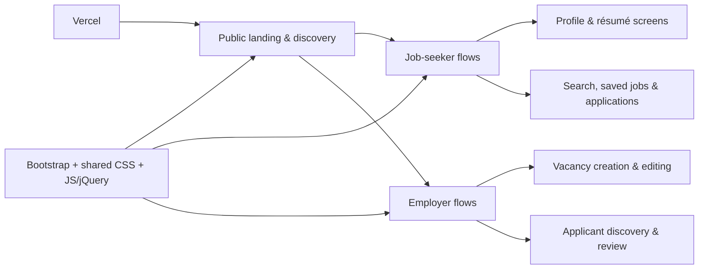

# JobRuit — Responsive Recruitment Platform Prototype

[](https://developer.mozilla.org/docs/Web/HTML)
[](https://getbootstrap.com/)
[](https://developer.mozilla.org/docs/Web/JavaScript)

**Live demo:** https://job-ruit.vercel.app

JobRuit is a multi-page front-end prototype for a recruitment platform serving job seekers and employers. It explores the complete user experience—from onboarding and profile creation to job publishing, applications, shortlisting, subscription plans, and account management.

> This repository is a front-end demonstration. Authentication, payments, email delivery, and persistent server-side data require a production backend.

## Experiences covered

### Job seekers

- Registration, login, password recovery, and OTP screens
- Personal profile and résumé creation
- Job discovery, application, saved jobs, and application tracking
- Subscription and account-management journeys

### Employers

- Company registration and profile completion
- Vacancy creation and editing
- Applicant discovery and profile review
- Candidate lists and employer account screens

## Tech stack

- Semantic HTML5
- CSS3 and responsive media queries
- Bootstrap
- JavaScript ES6 and jQuery
- Client-side form validation
- Font Awesome

## Project structure

```text
JobRuit/
├── css/        # Global and page styles
├── js/         # Interactions and validation
├── images/     # Interface assets
├── webfonts/   # Local font assets
└── *.html      # Job-seeker and employer flows
```

## Architecture at a glance



## Recruiter quick scan

- 72 connected HTML screens covering both candidate and employer journeys
- Separate job-seeker and employer experiences rather than a single landing page
- Responsive layouts built with Bootstrap, custom CSS, and media queries
- Client-side form validation and interactive flows using JavaScript and jQuery
- Portfolio demo clearly separated from backend-dependent features such as auth, payments, and email
- Live deployment on Vercel for direct review

## Run locally

```bash
git clone https://github.com/SamirNexus/JobRuit.git
cd JobRuit
```

Open `homeAfterLog.html` for the job-seeker experience or `corporateHomeAfterLog.html` for the employer experience. A local static server is recommended:

```bash
npx serve .
```

## Portfolio highlights

- Designed a broad, role-based recruitment journey across dozens of connected screens
- Created distinct job-seeker and employer experiences
- Implemented responsive layouts and reusable visual patterns
- Demonstrated product thinking beyond a single landing page

## Author

**Mohamed Samir** — Front-End Developer  
[GitHub](https://github.com/SamirNexus) · [LinkedIn](https://www.linkedin.com/in/samirnexus98/)
